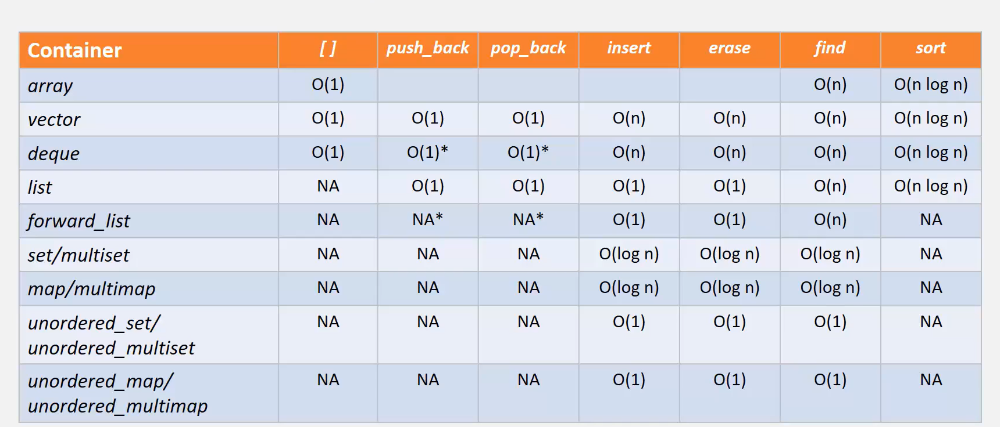

Class templates 
Class templates are frequently used in C++ to create classes that should be able to handle 
different types.
C++ STL, vector, list, map etc.

Lambda expressions defines an anonymous function object
Syntactic shortcut for a function object
can be passed as an argument
can accept parameters and return values

Lambda expression:
Typically encapsulates a few lines of code
Behaves like a normal function when invoked.
replaces fucntion objects
internally implements a nameless funtion object
use auto to provide an explicit name

lambda introducer, arguments, mutable specification, trailing return type  
[] {<args>}<mutable><exception specification> <return type>
{
lambda body
}

Generalized lambda capture
This feature allows creation of new variables in the capture clause
the type of these variables is deducted from the type produced by the expression
consequently these variables must always be initialized.
if the initializer expression is a variable, then the new variable can have 
the same name of different name

To create a reference we have to use the & operator before the variable name
[var=expression](args)
[&var=expression](args)

Unique ptr

Set and multi_set
map and multi_map

set is internally implemented as binary tree
Elements are stored in sorted order (< & >)
value acts as key
fast search
no random search
elements cannot be modified directly

Map/multimap

Implemented as a binary tree
stores a pair that contains a key and value
elements are stored in sorted order based on the key
fast search
no random access
keys can not be modified directly

Implemented as a binary tree
stores a pair that contains key and value
Elements are stored in sorted order based on a key
fast search
no random access
keys cannot be modified directly

Unordered containers
Associative containers implemented as hash tables
provides support of fast search, insertion deletion
but may degrade over a period of time
unordered_set stores values that act as keys for hashing
unordered_map stores pairs (first is used to compute hash)
iterators are constant

unordered_set stores values that act as keys for hashing
unordered_map stores pairs (first is used to compute hash)
iterators are constant

std::thread
Accepts a callable as constructor argument
the callable is executed in a separate thread
the constructor will not wait for the thread to start;
it returns immediately
